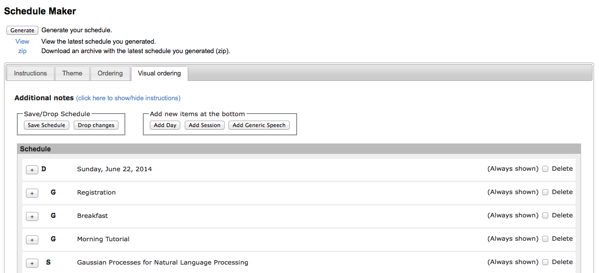

The "order" file determines the program, the order of the papers in
the proceedings, and the paper IDs.  In principle, the order file is
prepared and input by program chairs or book chairs.  However, you
have to keep an eye on the *well-formedness* of their order file, and
ask program/book chairs to fix it if necessary.  It is a good idea to
let program/book chairs to read this page before they make their order
files (in particular "Style guideline").

## What are affected by the order file

The order file affects the followings:

* The order of papers in the PDF and CD-ROM proceedings
* program.html (appears in the top page of the conference/workshop)
* The program in the PDF proceedings
* Paper ID (IDs are automatically assigned based on the order in the proceedings)

## How to edit the order file

You can input the order file in "ACLPUB > Order".  Three methods are available:

1. Upload an Excel file via Schedule Maker
    * Schedule Maker is a START tool to create/edit a schedule and an ordering of papers.  You can find it in "ACLPUB > Order > Schedule Maker", or simply "Schedule Maker" from the top console.
    * Prepare an Excel file describing the schedule and the order of the papers, and upload it to the system.
    * This is recommended if you have many papers (as in main conferences), or you need to produce multiple order files from one program (e.g. make separate order files of long and short papers from one program).
	* [Sample Excel file](schedulemaker2_example.xls)
2. Visually edit orderings in Schedule Maker
    * Schedule Maker has an interface to visually edit a schedule and orderings.  You can find it in "Visual ordering" in Schedule Maker.
    * This is sufficient if you don't have many papers, or when you make minor final revisions.
    * 
3. Input/edit the order file directly
    * You can directly input/edit the order file in the text field in the "Order" page.
    * In this case you have to choose the option "Use the text below as order file".
    * You can also auto-generate the order file from Schedule Maker (by clicking "Import Order from ScheduleMaker"), and edit it.  This will be useful for last-minute editing.
    * This tool is useful when you prefer text editing rather than Excel.  Also, you might need to use this function when you have to make editing that cannot be done using Schedule Maker.
    * The order file looks like this:

```
    * Monday, June 23, 2014
    + 7:30--18:00 Registration
    + 7:30--9:00 Breakfast
    + 8:55--9:00 Opening session
    + 9:00--9:40 President talk
    + 9:40--10:10 Coffee break
    = Session 1A: Discourse, Dialogue, Coreference and Pragmatics
    111 10:10--10:35 # Paper title 1...
    222 10:35--11:00 # Paper title 2...
```

## Style guideline

The basic guideline is described in START, but you also need to
conform to the following guidelines, so that the tools to generate the
conference handbook work correctly.  Most of the guidelines described
here are automatically followed when you use Schedule Maker rather
than directly editing the order file.

The following guideline is a summary of the guideline described in
[ACLPUB HOWTO](http://nlp.csie.ncnu.edu.tw/~shin/acl2010/publication/howto/aclpub/ACLPUB.START.2.htm).  For details, see the original page.

* Times
    * Times should be specified using a 24-hour clock: e.g.  
    `+ 7:30--18:00 Registration`
	* Use double dash between times
    * Don't put times in session titles like:  
    `= (10:10-11:40) Discourse`
    * Don't enclose times in parenthesis
* Marks
    * Use `*` to put a date
	* Use `=` to put a session title
	* Use `+` to put an event that does not correspond to papers
      (e.g. registration, invited talks, etc.).  *Do not use `=` to
      put these events* (and do not put times when you use `=`)
    * Put a paper ID for individual papers, followed by a time slot
      (optional).  You don't have to put a time slot if it does not
      have a specific time slot (e.g. poster papers).
	* Any texts following `#` are ignored

## Tips

* When you want to include a new paper: you need to submit it as a new
  paper and accept it.  An ID is assigned, and you can put this paper
  in Schedule Maker or in the order file.
* When you want to order papers differently from the order in the
  program (e.g. put an invited talk paper as the first paper in the
  proceedings, while put it in a scheduled place in the program): This
  is tricky and it is not recommended to do this.  If you really need
  this, follow these steps (You have to repeat this procedure when you
  or program/book chairs modify the order file.):
    * Put an ID of this paper in the place where you want to make it
      appear in the proceedings (e.g. the first line in the order
      file).  Papers will be ordered based on this information.
    * Go to "Program" tab, and click "Import Program and Toc".  A
      latex source of the program (program.tex) is automatically
      generated from the order file, and appears in the text field.
      Edit this source as you need (e.g. move the line of the invited
      talk to an appropriate place), and click "Save Program and Toc".
    * Go to "Generate" tab.  Check the box "Check this box to use the
      customized program.tex..."), and generate the proceedings (click
      "All").  You will get "proceedings.tgz", which includes book.pdf
      and CD-ROM proceedings (in "cdrom/").
    * Verify that book.pdf looks as you desired.
	* Edit "cdrom/program.html" manually as you need (e.g. move the
      line of the invited talk to an appropriate place).
  
